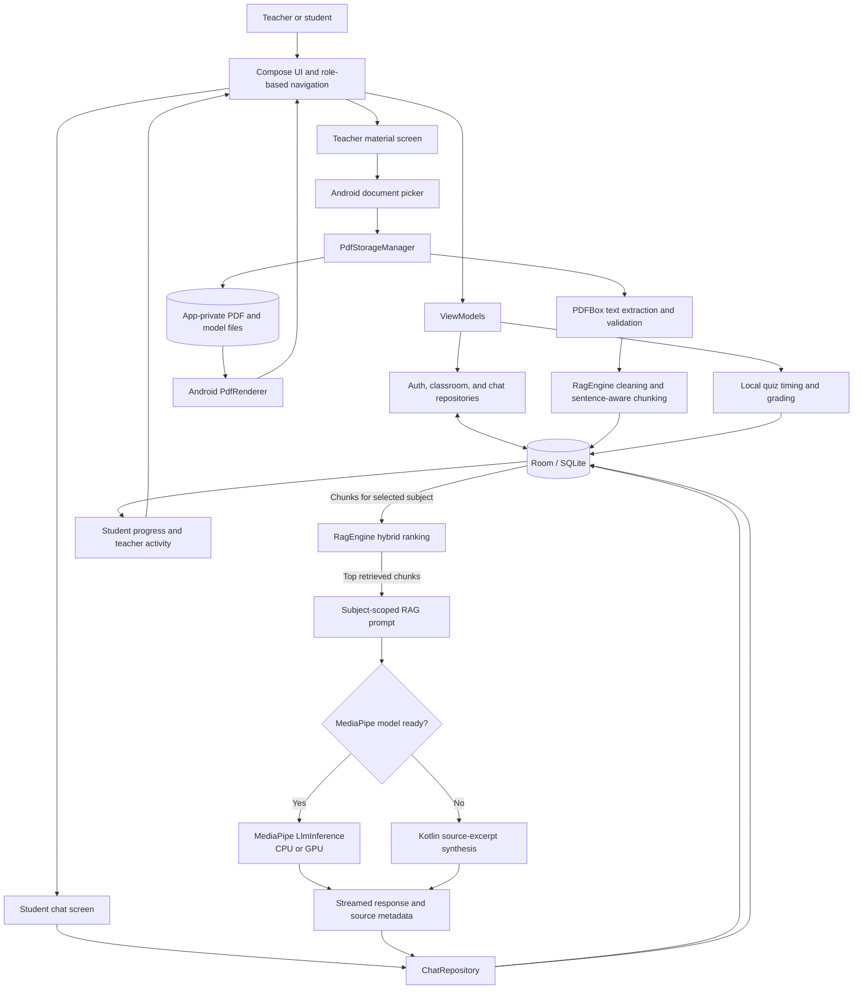

# 1. About the Project

**Offline Genius** is a native Android smart-classroom and study app built around locally stored curriculum materials. Teachers can organize subjects, prepare study materials and multiple-choice quizzes, while students can read those materials, ask curriculum questions, and review quiz progress.

The project is intended for teachers and students who need classroom study tools that remain usable without a server connection. It addresses the practical problem of keeping course documents, retrieval, AI assistance, quizzes, and results together on an Android device. Its main objective is to provide subject-scoped study workflows with optional on-device Gemma inference and a source-excerpt fallback when a model is not installed.

# 2. Technology Stack Used

| Category | Technologies in the project |
| --- | --- |
| Programming language | Kotlin; Java 11 source/target compatibility for the Android module |
| Frontend/UI | Jetpack Compose, Material 3, Compose Material icons, Compose Navigation |
| Backend | No remote application server; local Kotlin repositories and ViewModels provide the application logic |
| Application architecture | Android Activity, repositories, ViewModels, Kotlin Coroutines and Flow |
| Database | Room 2.7 over SQLite; database name `offline_genius.db`, schema version 5 |
| AI/LLM | MediaPipe Tasks GenAI 0.10.35 `LlmInference`; compatible Gemma model files are imported by the user and are not bundled |
| Retrieval/RAG | Kotlin `RagEngine`: text cleaning/chunking, term-frequency storage, BM25-style scoring, heuristic 64-dimensional vectors with cosine similarity, and query-pattern reranking |
| PDF/document handling | PDFBox Android 2.0.27.0 for text extraction; Android `PdfRenderer` for page rendering; Storage Access Framework for file selection |
| Android/native APIs | Android SDK, AndroidX Core, DocumentFile, FileProvider, `PdfDocument`, `PdfRenderer`, MediaStore Downloads |
| Build/dependency tools | Android Gradle Plugin 9.1.1, Kotlin 2.2.10, Gradle 9.3.1 distribution configured in wrapper properties, KSP, version catalog |
| Tests | JUnit 4, Robolectric, AndroidX test, Espresso, Compose UI testing |

**Retrieval clarification:** the project does not include a vector database or a learned embedding model. `RagEngine` constructs its own 64-value vectors using hand-authored academic concept features and hashed, frequency-weighted token features. It combines cosine similarity with BM25-style term matching and explanatory-pattern boosts; candidate chunks are loaded from Room for the selected subject.

**No remote application backend is implemented.** Authentication, curriculum data, chat, quiz grading, and activity summaries are local. Firebase AI/App Check, Retrofit, OkHttp, and Moshi dependencies/plugins appear in Gradle configuration, but the current Kotlin application source does not call those services or libraries. Firebase Auth, Firestore, CameraX, Credential Manager, and location dependencies are commented out or otherwise not active.

There is no project-owned C/C++ or JNI layer. MediaPipe supplies its own inference runtime/native libraries; PDF rendering uses Android platform APIs.

# 3. Overview of the Project

1. **Create or sign in to a local profile.** Registration stores a username, role, profile fields, salt, and SHA-256 password hash in Room. The role selects the teacher or student interface. There is no remote identity provider or cross-device account service.
2. **Prepare the classroom as a teacher.** Create subjects, then add a PDF or enter curriculum text. PDF import copies the original into app-private storage, extracts text with PDFBox, validates the extracted text, cleans it, and saves the material plus indexed chunks in Room. Entered text is also saved as a generated PDF and indexed.
3. **Use the materials as a student.** Students can search/filter subjects and materials, open locally rendered PDFs, and save PDFs to the device's Downloads folder.
4. **Ask a curriculum question.** The chat repository saves the question, loads chunks for the chosen subject, and asks `RagEngine` to rank them. Up to three retrieved chunks are cleaned and placed into a subject-specific prompt. If MediaPipe has a loaded model, the prompt is passed to Gemma 3 1B for streamed generation. Otherwise, Kotlin fallback logic selects and formats relevant sentences or list items from the retrieved chunks.
5. **Save and review activity.** Chat messages and retrieved-source metadata are stored in Room. Teachers author four-option quizzes with a correct answer and optional explanation. Students take timed quizzes; the app grades selected options locally and saves attempts for student progress and teacher activity screens.

The main UI-to-data path is `Compose screen -> ViewModel -> Repository -> Room/AI/PDF utility`. Long-running PDF, database, and inference operations use coroutines on background dispatchers. `AppViewModelFactory` creates the database, repositories, and view models; app startup also initializes PDFBox and schedules reprocessing of existing stored materials. The Room builder currently uses `fallbackToDestructiveMigration()`, so a schema change without a migration can erase the app's local database.

PDF text extraction is not OCR. PDFs without usable text (for example, scanned image-only PDFs) can fail the text validation step and are not indexed. The viewer renders at most 30 PDF pages per load. Local app data is not synced by an application server; Android backup is enabled in the manifest and OS/device backup behavior may still apply.

# 4. System Architecture



**RAG details:** the app stores chunk text and term-frequency JSON in Room, not precomputed model embeddings. For each question, `RagEngine` computes query/chunk vectors locally, calculates cosine similarity and a BM25-style lexical score, applies syllabus/index penalties and explanatory-pattern boosts, then returns the highest-ranked chunks. The top three are used as context. There is no external vector store, embedding API, web service, or custom JNI bridge in this flow.

# 5. Key Capabilities

- **Local teacher/student profiles:** Register and sign in on the device, with role-based screens and salted SHA-256 password hashes stored in Room.
- **Subject management:** Teachers create and delete subjects with a name, code, description, teacher name, and color. Students can search subjects and jump to materials, chat, or quizzes.
- **Curriculum material ingestion:** Import PDFs through Android's document picker or enter text manually. The app saves a local PDF, extracts and validates text, removes common PDF artifacts, creates overlapping sentence-aware chunks, and stores term frequencies for retrieval.
- **Offline PDF reading and export:** Render local PDF pages, move between pages, zoom, and export PDFs to Downloads. PDF export uses Android APIs; PDF viewing renders up to 30 pages per load.
- **Subject-scoped RAG chat:** Rank local chunks using heuristic semantic vectors, BM25-style scoring, and query-specific reranking. Display source chunks, matched terms, scores, and answer path in the chat UI; save conversations and source metadata in Room.
- **Optional on-device Gemma inference:** Import a compatible model file through Model Setup; the engine copies it to app-private storage, computes MD5/SHA-256 checksums, checks memory/ABI conditions, and loads MediaPipe inference. CPU and GPU backends and 256/512 output-token settings are available.
- **Excerpt fallback:** When a model is absent, loading, or failed, return an answer synthesized from the retrieved curriculum excerpts. If no usable chunks match, the fallback can report that the answer was not found in uploaded materials.
- **Teacher-authored quizzes:** Create subject-linked multiple-choice quizzes with four options, a correct option, optional explanation, difficulty, and time limit.
- **Local quiz grading and progress:** Students navigate timed questions, submit or time out, see scores and answer explanations, and review attempt history and score trends. Teachers see locally registered students, quiz attempts, and class averages.
- **On-device diagnostics:** Record crash/model initialization/inference details locally; the model screen can display, clear, and share the diagnostic log.

# 6. UI Walkthrough

The UI is built from Jetpack Compose screens. The navigation shell presents separate bottom-navigation tabs for each local account role. No screenshot files are included in the repository.

## Shared Screens

| Screen | Purpose and main actions | Navigation |
| --- | --- | --- |
| Sign In / Create Account | Toggle between login and registration; enter username/password; registration includes name, Student/Teacher role, and grade or department. | Shown before the role-specific app; successful local auth opens the matching navigation shell. |
| PDF Viewer | Render page images, show page count, zoom in/out, move between pages, retry rendering, and export to Downloads. | Opened by selecting a material from either role's Materials screen; back returns to that screen. |

## Student Screens

| Screen | Purpose and main actions | Navigation |
| --- | --- | --- |
| Subjects / Course Curriculum | Search available subjects by name, code, or description; each subject has Materials, Ask AI, and Quizzes actions. | Default student tab; actions select the subject and open the corresponding tab. |
| Materials / Course Study Materials | Filter by subject, search title/file/text, inspect excerpts, open a PDF, or download it. | Student bottom-navigation tab; PDF opens the shared viewer. |
| AI Tutor Chat | Select a subject, ask free-text or suggested questions, view streamed answers and source chunks, toggle RAG debug information, start a new conversation, or open history. Model status and fallback state are visible. | Student bottom-navigation tab; history opens from the chat toolbar. |
| Conversation History | Browse saved conversations with last-message/date summaries; reopen or delete a conversation. | Opened from chat; selecting an entry returns to chat, and Back returns to the previous chat view. |
| Quizzes | Filter quizzes by subject and start a timed multiple-choice quiz. During a quiz, navigate questions, select options, submit, or let the timer submit. Results show score and answer explanations, with retake/return actions. | Student bottom-navigation tab; subject selection can also come from the Subjects screen. |
| Progress / Learning Performance | View average score, completed attempts, perfect scores, recent score chart, and attempt history. | Student bottom-navigation tab. |

## Teacher Screens

| Screen | Purpose and main actions | Navigation |
| --- | --- | --- |
| Materials & RAG / Study Material | Filter materials by subject; import a PDF or enter curriculum text; monitor processing; open, rename, download, or delete materials. | Default teacher tab; opens the shared PDF viewer. Requires a subject before material creation. |
| Subjects / Course Management | Create subjects with metadata and a badge color; review or delete existing subjects. | Teacher bottom-navigation tab. |
| Create Quiz / Checkpoint Quiz | Choose a subject, set title, description, time limit, difficulty, questions, four options, correct answers, and optional explanations; save/publish locally. | Teacher bottom-navigation tab; created quizzes appear in the student Quizzes screen on the same app installation. |
| Activity / Student Activity & Analytics | Review local student profiles, quiz submission counts, class average, and recent attempt details. | Teacher bottom-navigation tab; data comes from the same on-device database. |
| Model Setup & AI Engine | Import/reload/delete a model; view status, file format/checksums, RAM and ABI information; select CPU/GPU and token budget; review/export diagnostics. | Teacher bottom-navigation tab and teacher settings shortcut in the top bar. |

**Model screen note:** the current “On-Device Inference Benchmark Test” button displays a delayed status/demo response; it does not call the model or measure actual token-generation latency. The actual chat flow does call MediaPipe inference when the model is ready.

# 7. Quick Start

## Prerequisites

- Android Studio with a Gradle runtime JDK 17 or newer. Java source/target compatibility is set to 11.
- Android SDK Platform 36, extension level 1 (the configured compile SDK); target SDK 36.
- An Android 7.0 (API 24) or newer device/emulator. On-device model inference is configured for `arm64-v8a` and `x86_64` ABIs.
- About 4 GB of memory available to Gradle is configured in `gradle.properties` (`-Xmx4g`).

## Get the Project

Clone using the repository URL available to you, then open the project root (the directory containing `settings.gradle.kts`) in Android Studio:

```powershell
git clone <repository-url> Offline-Genius
Set-Location Offline-Genius
```

Let Android Studio sync the project and install the requested Android SDK components. The initial build needs network access to download the Gradle distribution and dependencies. The repository contains `gradle/wrapper/gradle-wrapper.properties` but does **not** contain `gradlew` or `gradlew.bat`; use Android Studio's Gradle integration unless you first restore/generate the wrapper launcher scripts.

## Debug Signing Setup

The debug build explicitly references `<project-root>/debug.keystore`, which is ignored by Git and is not included in this checkout. Generate a local key from a JDK terminal before building/running if the file is absent:

```powershell
keytool -genkeypair -v -keystore debug.keystore -storepass android -alias androiddebugkey -keypass android -keyalg RSA -keysize 2048 -validity 10000 -dname "CN=Android Debug,O=Android,C=US"
```

This command creates a development key using the same alias/password values configured in `app/build.gradle.kts`. Do not use this debug key for a published release.

## Build and Run

1. In Android Studio, wait for Gradle sync to finish and select an API 24+ device or emulator with a supported ABI.
2. In the Gradle tool window, run `:app:assembleDebug` to build, or select the `app` configuration and click **Run** to install and launch it.
3. To run local JVM tests, run `:app:testDebugUnitTest`. To run instrumentation tests, connect an Android device/emulator and run `:app:connectedDebugAndroidTest`.

Release builds use a separate upload-key configuration. Set `KEYSTORE_PATH`, `STORE_PASSWORD`, and `KEY_PASSWORD`; the configured alias is `upload`. The referenced keystore is not included.

## First Use and Model Setup

1. Create a local account and choose Student or Teacher. These profiles exist only in the app's local database.
2. Sign in as a teacher and create a subject before adding materials or quizzes.
3. Import a text-based curriculum PDF or add text manually. A PDF that does not yield valid extractable text (such as a scan without a text layer) will not be indexed; there is no OCR implementation.
4. For actual generated LLM answers, obtain a compatible MediaPipe Gemma 3 1B model file (the model screen accepts `.task` or `.litertlm`, and displays an approximate 0.5-1 GB size) from a source whose license permits your use. Transfer it to the device and import it from **Model Setup**. The model is not checked into this repository or downloaded by the app. Ensure sufficient free storage and memory; the engine requires roughly 1.5 GB available RAM to load outside tests.
5. Without an imported/loaded model, retrieval and excerpt-based fallback answers still work locally.

No `.env`, `GEMINI_API_KEY`, or `google-services.json` is required for the implemented local workflows. The Google Services Gradle plugin is configured to warn when `google-services.json` is missing. The app manifest declares no `INTERNET` permission. Runtime study workflows are local, but model acquisition and first-time Gradle dependency downloads require an external connection. App data backup is enabled by the manifest; Android OS backup/transfer behavior depends on device settings.

## Troubleshooting

| Symptom | Check |
| --- | --- |
| `debug.keystore` not found or debug package signing fails | Generate the local development keystore using the command above. The file is intentionally ignored and must not be committed. |
| SDK platform/extension is missing | Install Android SDK Platform 36 with extension level 1 in Android Studio's SDK Manager, then sync again. |
| Firebase/Google Services warning during sync | This checkout has no `google-services.json`; the plugin is configured to warn. It is not required by the implemented offline app flows. |
| `gradlew`/`gradlew.bat` is missing | This checkout includes wrapper properties but not launcher scripts. Build from Android Studio or generate/restore wrapper scripts before using terminal wrapper commands. |
| Model stays Not Installed or fails to load | Confirm the selected file is a compatible MediaPipe model, the device ABI is `arm64-v8a` or `x86_64`, and there is sufficient free storage and RAM. Inspect the model diagnostics in **Model Setup**. |
| PDF import reports extraction/validation failure | Use a text-based PDF with an extractable text layer; scanned-image OCR is not implemented. |
| Release signing fails | Provide an upload keystore and the `KEYSTORE_PATH`, `STORE_PASSWORD`, and `KEY_PASSWORD` environment variables. |

# 8. Project Directory Map

```text
Offline-Genius/
├── app/
│   ├── build.gradle.kts
│   ├── proguard-rules.pro
│   └── src/
│       ├── main/
│       │   ├── AndroidManifest.xml
│       │   ├── java/com/example/
│       │   │   ├── MainActivity.kt
│       │   │   ├── OfflineGeniusApp.kt
│       │   │   ├── ai/
│       │   │   │   ├── llm/MediaPipeLlmEngine.kt
│       │   │   │   └── rag/RagEngine.kt
│       │   │   ├── data/
│       │   │   │   ├── local/
│       │   │   │   │   ├── AppDatabase.kt
│       │   │   │   │   ├── dao/
│       │   │   │   │   └── entities/
│       │   │   │   └── repository/
│       │   │   ├── ui/
│       │   │   │   ├── components/
│       │   │   │   ├── navigation/
│       │   │   │   ├── screens/
│       │   │   │   │   ├── auth/
│       │   │   │   │   ├── common/
│       │   │   │   │   ├── student/
│       │   │   │   │   └── teacher/
│       │   │   │   ├── theme/
│       │   │   │   └── viewmodels/
│       │   │   └── util/
│       │   └── res/
│       ├── test/java/com/example/
│       └── androidTest/java/com/example/
├── gradle/
│   ├── libs.versions.toml
│   └── wrapper/gradle-wrapper.properties
├── build.gradle.kts
├── gradle.properties
├── settings.gradle.kts
├── .env.example
├── metadata.json
└── README.md
```

- `app/src/main/java/com/example/ui/` contains the Compose screens, role-based navigation, reusable components, theme, and ViewModels.
- `app/src/main/java/com/example/data/` contains Room entities/DAOs and the local authentication, classroom, and chat repositories.
- `app/src/main/java/com/example/ai/rag/` contains text cleanup, chunking, prompt construction, and hybrid retrieval/ranking.
- `app/src/main/java/com/example/ai/llm/` contains MediaPipe model import, lifecycle, backend selection, and on-device response generation/fallback logic.
- `app/src/main/java/com/example/util/` contains PDF extraction/storage/render helpers, password hashing, and crash/model diagnostic logging.
- `app/src/main/res/` contains launcher assets, strings, themes, backup rules, and FileProvider paths.
- `app/src/test/` contains JUnit/Robolectric tests for retrieval, PDF text processing, local repositories, and related behavior; `app/src/androidTest/` contains the device context smoke test.
- `gradle/libs.versions.toml` centralizes dependency/plugin versions. `gradle/wrapper/gradle-wrapper.properties` names the Gradle distribution but this checkout has no wrapper launcher scripts.
- `.env.example` and `metadata.json` are AI Studio-era project metadata. Their Gemini/server-side capability text is not implemented by the current Android application source and is not required to run its local workflows.